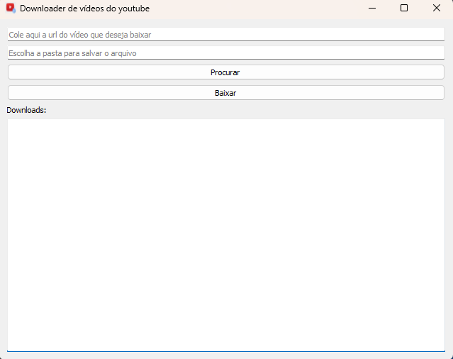
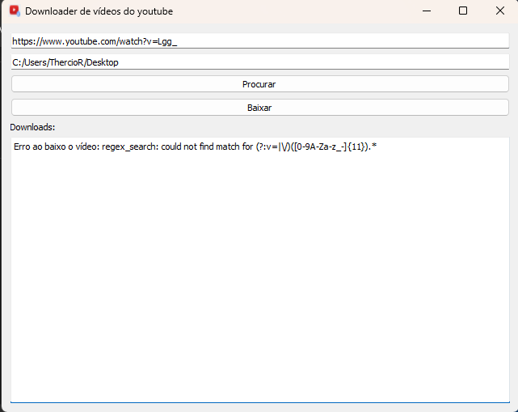

# 🖥 YoutubeDownloader App

#### 📝 **Descrição**

Este aplicativo foi construído e desenvolvido apenas em Python utilizando a biblioteca PyQt5, fornecendo uma interface gráfica (GUI) para realizar o download de vídeos do Youtube, ao inserir os seus links, de forma simples e eficiente.

Na versão atual (v1.0), o aplicativo permite o usuário inserirem a URL do vídeo, escolherem a pasta de salvamento e iniciar o processo de download com apenas um clique.

Além disso, o aplicativo contém uma área de visualização de retorno de respostas, que pode retornar o Vídeo e o local em que ele foi salvo ou em caso de erro retornar uma mensagem descrevendo o código e o erro que ocorreu.

## 📉 Versão

Atualmente, a aplicação encontra-se na versão 1.0 e oferece os seguintes recursos e funcionalidades:

- Inserção de URL do vídeo do Youtube.
- Seleção da pasta onde o vídeo será salvo.
- Iniciar o download com um clique em um botão.
- Visualização de vídeos baixos ou descrição do erro em caso de falha.

## 🧰Stack utilizada

**Front-end:** GUI PyQt5

**Back-end:** Python

## 🛠 Instalação

#### ⚙️ **Instalação e ativação do ambiente virtual**

Antes de instalar as dependências, é necessário instalar e ativar o ambiente virtual do seu projeto. Para isto:


* No terminal, vá para a pasta onde o projeto foi baixado e execute o comando abaixo:

    `python -m venv venv`

* Será criado uma pasta com o nome venv. Para ativar será necessário fazer o seguinte comando:

```bash
venv\Scripts\activate # para Windows
source venv/bin/activate # para Linux
```

#### 📦 **Instalação das dependências**

Instale as dependências ``PyQt5`` e ``PyQt5`` conforme abaixo:

```bash
  pip install PyQt5 pytube
```

Agora o projeto está configurado e pronto para rodar.

## 🖥 Execução e utilização

#### **📊 Executando**

Para executar a aplicação, basta rodar no terminal, na pasta em que o projeto está localizado, o seguinte compando:

```bash
#Para Windows
python app.py

#Para Linux
python3 app.py
```

#### **💻Utilização**

Para utilizar a aplicação, é só seguir os passos a seguir:

1. Insira a URL do vídeo do Youtube no campo indicado.

   
2. Escolha o local que deseja salvar o vídeo no botão procurar.
3. Feito isso, clique no botão *"**Baixar**"* e seu vídeo será baixado.
4. Uma saída será informado na área de visualização:

* Se tudo ocorreu bem, o nome do vídeo e o local em que foi salvo será exibido (conforme imagem abaixo).

  
* Se houve um erro no processo, uma descrição do erro será exibida (conforme imagem abaixo).

  

## 👨🏻‍💻Desenvolvedores / Colaboradores

- [Thércio Rodrigues](https://www.github.com/thercior)
